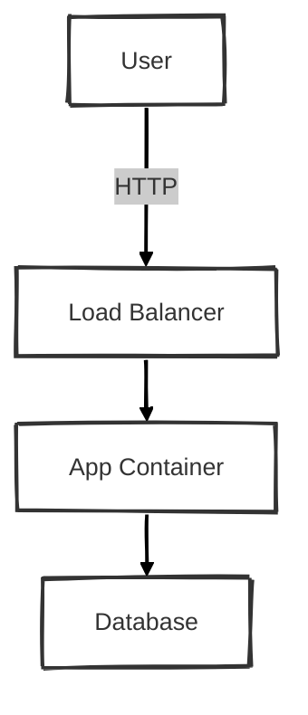

# Mermaid Architect

Standardized skill for generating high-quality Mermaid diagrams with specific aesthetic and syntax rules.

## Core Configuration (Hand Drawn)

ALWAYS use this YAML frontmatter for diagrams to achieve the 'Sketch/Hand-Drawn' look:

```mermaid
---
config:
  layout: elk
  theme: neo
  look: handDrawn
---
graph TB
```

## Syntax Rules (CRITICAL)

1.  **Quote All Labels**: To prevent syntax errors with special characters ( like `()` or `[]` ), ALWAYS wrap node text in double quotes.
    *   ❌ Wrong: `Node[Database (SQL)]`
    *   ✅ Right: `Node["Database (SQL)"]`

2.  **Class Definitions**: Use standard class definitions for consistency.
    *   `classDef storage fill:#f9f,stroke:#333,stroke-width:2px;`
    *   `classDef compute fill:#ccf,stroke:#333,stroke-width:2px;`
    *   `classDef network fill:#dfd,stroke:#333,stroke-width:2px;`

## Templates

### Architecture Diagram


