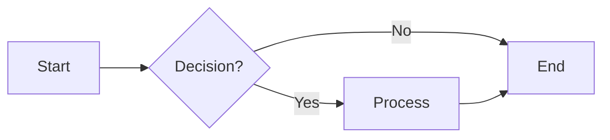
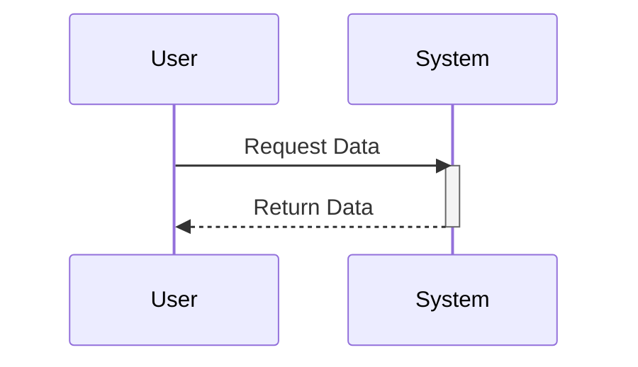
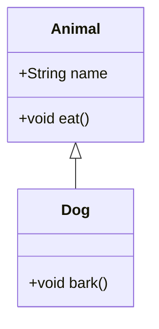

# Mermaid Syntax Reference

## Flowchart

- **LR**: Left-to-Right layout
- **TD**: Top-Down layout
- `{}`: Rhombus (Decision)
- `[]`: Rectangle (Process)
- `()`: Rounded Rectangle

## Sequence Diagram

- `->>`: Solid line with arrow (Sync call)
- `-->>`: Dashed line with arrow (Async reply)
- `activate`/`deactivate`: Lifeline status

## Class Diagram

- `<|--`: Inheritance
- `+`: Public
- `-`: Private
